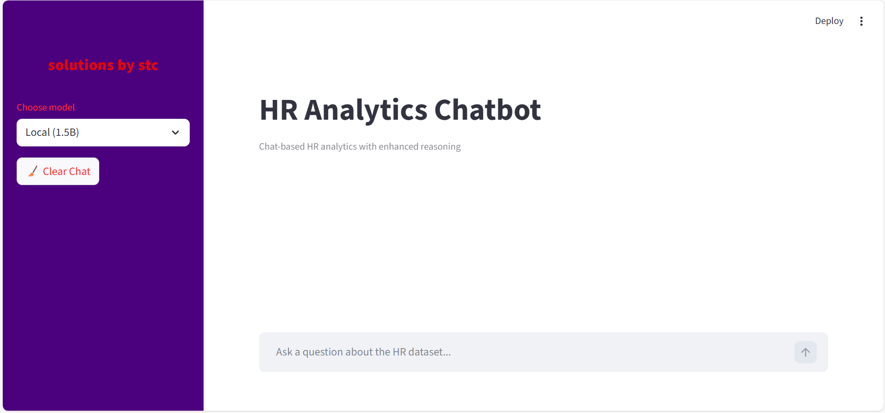
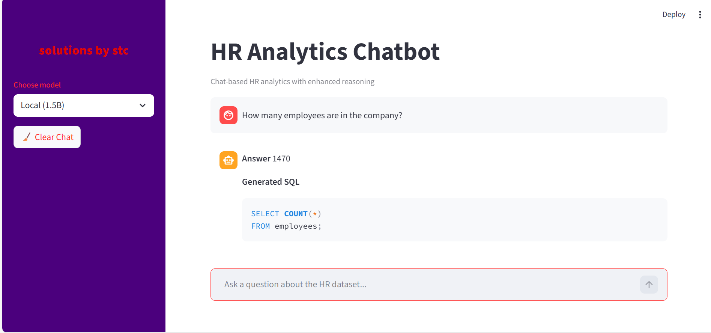

# HR Analytics Chatbot

An AI-powered **chat-based HR analytics dashboard** that allows users to ask natural language questions about HR data and receive accurate, data-backed answers.

This project uses a **Text-to-SQL approach**, supports **dual AI models (local and cloud)**, and maintains **chat memory** for follow-up questions. The dashboard is built using **Streamlit** and styled to match **Solutions by stc** branding.

---

## 🔹 Features

- 💬 Chat-based interface for HR analytics
- 🧠 Natural language → SQL conversion (Text-to-SQL)
- ⚡ Dual-model architecture:
  - **Local model (1.5B)** for fast responses
  - **Cloud model (7B via Groq API)** for higher accuracy
- 🔁 Automatic fallback to cloud model when needed
- 🧾 SQL-backed answers using structured HR data
- 📊 Tabular results displayed when applicable
- 🧠 Chat memory for follow-up questions
- 🎨 Branded dashboard UI (Solutions by stc identity)

---

## 🔹 Technologies Used

- Python
- Streamlit
- Pandas
- DuckDB
- Groq API
- Hugging Face / Local LLM
- Text-to-SQL prompting
- Git & GitHub

---

## 📁 Project Structure

```text
hr-analytics-chatbot/
│
├── app/
│   ├── app.py
│   └── assets/
│       ├── dashboard.png
│       ├── answered_question.png
│       └── chat_memory.gif
│
├── models/
│   ├── local_model.py
│   └── cloud_model.py
│
├── data/
│   └── WA_Fn-UseC_-HR-Employee-Attrition.csv
│
├── requirements.txt
├── environment.yml
├── README.md
└── .gitignore
```


---

## 🔹 How the Chatbot Works

1. The user asks a question in plain English  
2. The AI model converts the question into a SQL query  
3. The SQL query is executed on the HR dataset using DuckDB  
4. Results are returned as a natural language explanation and a table (when applicable)  
5. Conversation history is stored in session state to support follow-up questions  

---

## 🔹 Dual-Model Approach

The chatbot uses two AI models:

### Local Model (1.5B)
- Runs locally
- Faster response time
- Used by default

### Cloud Model (7B)
- Accessed via Groq API
- Higher accuracy
- Automatically used when:
  - The local model fails
  - SQL is invalid
  - The result is unreliable

This approach balances **performance and accuracy**.

---

## 🔹 Why Text-to-SQL (Not RAG)?

- The HR dataset is **structured (CSV / tabular data)**
- Text-to-SQL ensures:
  - Accurate counts and percentages
  - No hallucinated values
  - Transparent and explainable queries

RAG is more suitable for **unstructured data** such as documents, policies, or PDFs, which are outside the scope of this project.

---

## 🔹 Chat Memory

The chatbot maintains **session-level memory**, allowing users to ask follow-up questions such as:

- “What about only the Sales department?”
- “Now compare it with Research & Development”

This is implemented using **Streamlit session state**.

---

## 📸 Screenshots & Demo

### Dashboard Interface


### Example Question & Answer


### Chat Memory Demonstration
The GIF below shows the chatbot answering two related questions, demonstrating that conversation memory is preserved.


---

## 🔹 Environment Setup

### Conda (Recommended)

```bash
conda env create -f environment.yml
conda activate hr_analysis
pip install -r requirements.txt
streamlit run app/app.py
```


